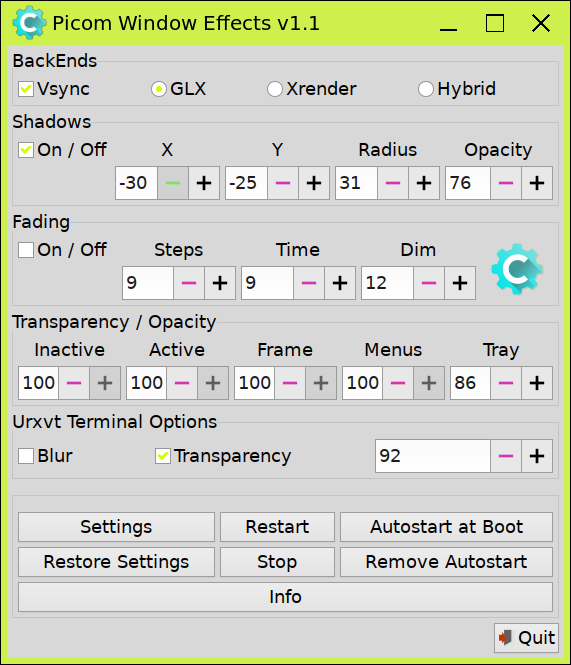

# picom-gtk

### pre install
* use distros package manager to install `gtkdialog` 

### install
```shell
git clone HTTP_ADDRESS_HERE 
cd picom-gtk/picom-gtk/
sudo cp -r usr /
cp -r picom ~/.config/picom
sudo chmod 777 /usr/bin/picom-gtk
```

### start picom-gtk
```shell
picom-gtk
```

### uninstall
```shell
sudo rm /usr/bin/picom-gtk
sudo rm /usr/share/applications/Picom.desktop
sudo rm /usr/share/icons/hicolor/scalable/apps/compton.svg
```

simple picom settings editor written in gtkdialog


